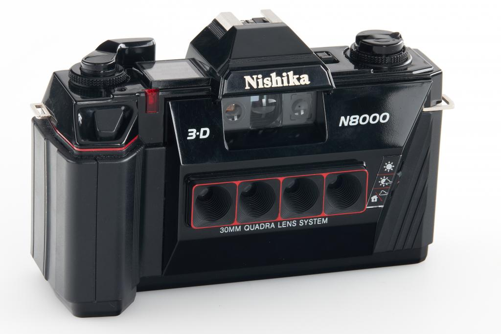

# virtual-nishika-n8000

A repository dedicated to the emulation of the Nishika N8000 with the help of 3D Photo Inpainting.

## What is a Nishika N8000?
The Nishika N8000 is a four lens SLR film camera originating in the United States.

What makes it so special is the four separate exposures it produces from a single shutter opening. This leads to an interesting artistic effect when the exposures are stitched together.

